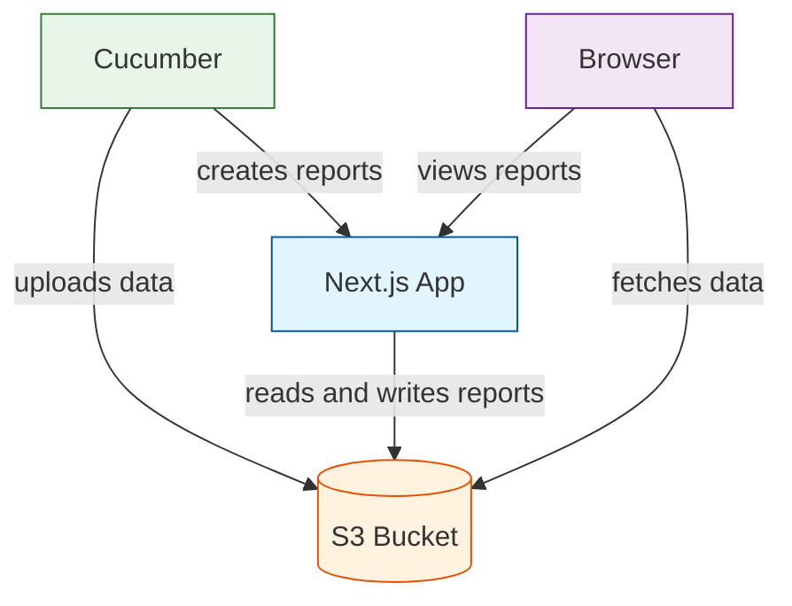
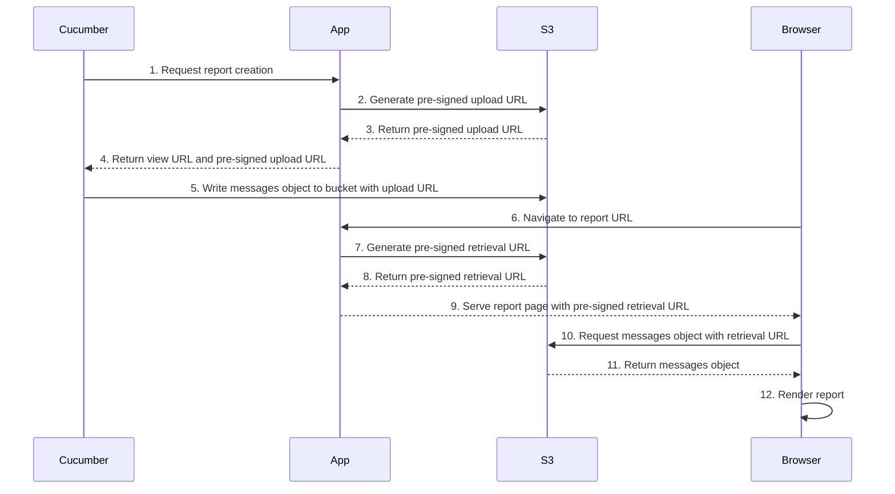
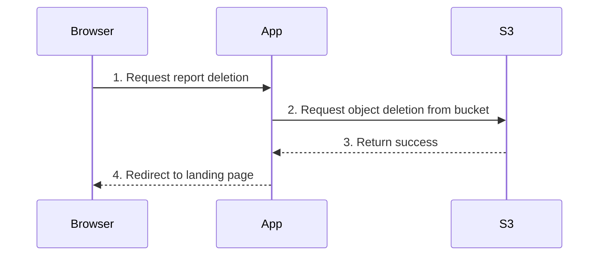

# Architecture

## Context

When we say you "publish a report" to Cucumber Reports, what we mean is that Cucumber (the thing you run the tests with e.g. cucumber-jvm) generates a stream of [Cucumber Messages](https://github.com/cucumber/messages) (the firehose of events from the test run), and sends those messages to Cucumber Reports (the service), so it can later render them as a human-readable report. In other words, the service is a repository for messages, with a coordination and view layer on top of them.

The main goals of this architecture are to be easy to maintain and cheap to run. We'll tolerate some platform coupling to get this.

## High-level architecture

At a high level, the service has just two parts:

- A [Next.js](https://nextjs.org/) app with server and client components
- An [AWS S3](https://aws.amazon.com/s3/) bucket for storing messages

The user is interacting with this from two places:

- Cucumber, with which they execute a test run — this in turn interacts with the app for coordination, and S3 for uploading messages
- A browser, with which they subsequently view the report — this in turn interacts with the app for coordination plus the view layer, and S3 for retrieving messages

## Sequences

### Publishing a report

### Deleting a report

